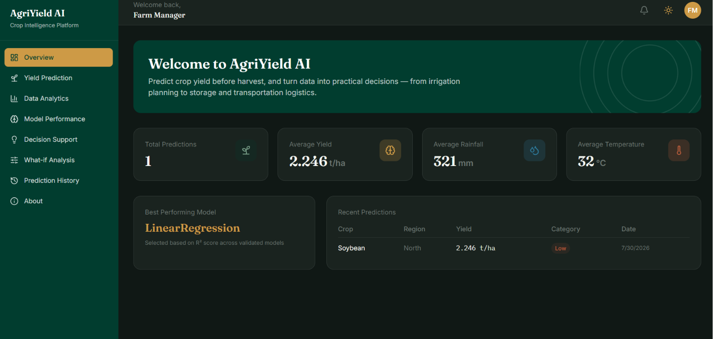
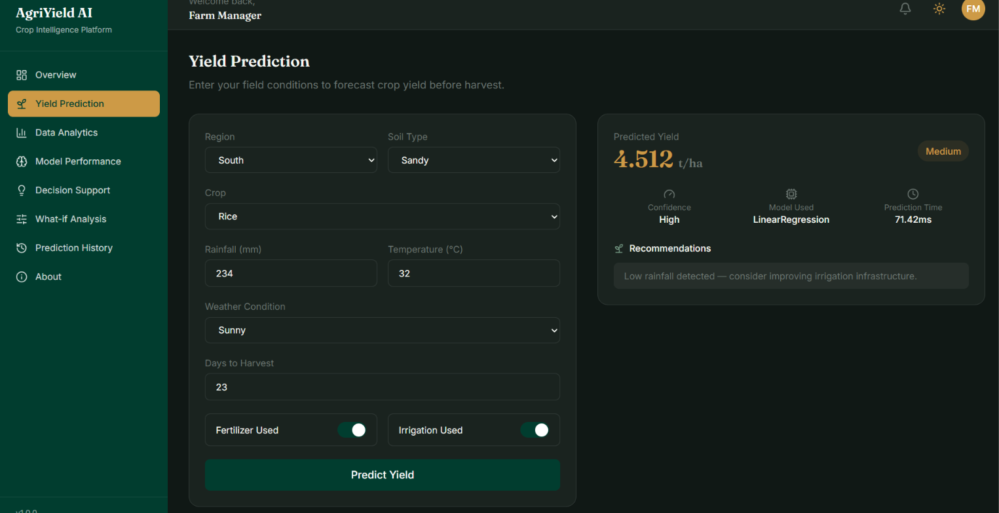
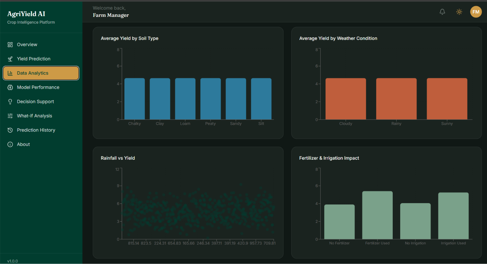
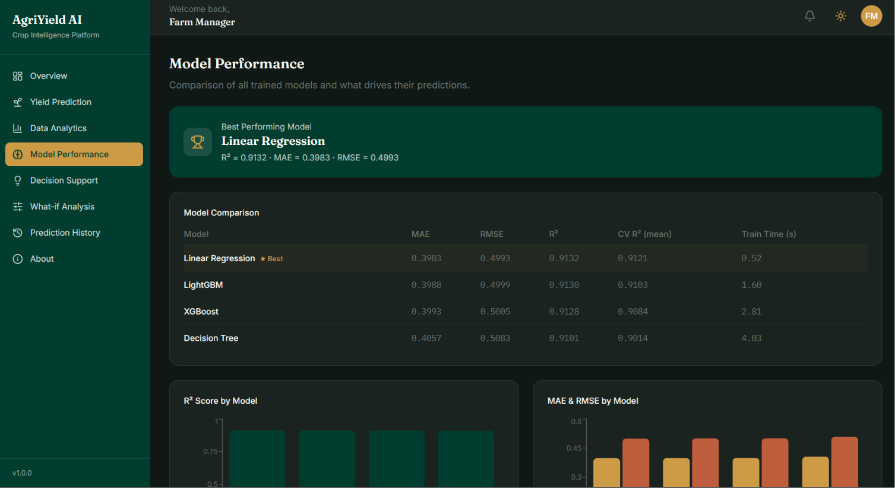
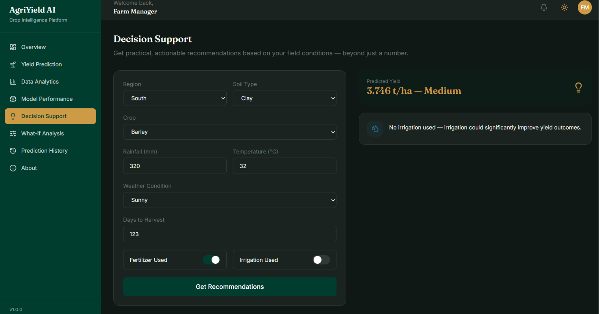
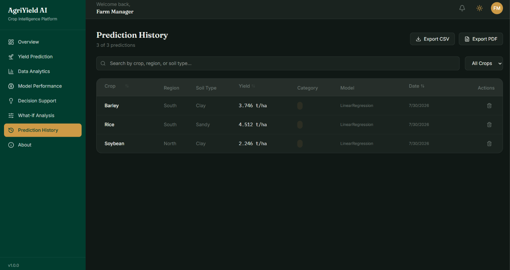

# 🌾 AgriYield AI

**Intelligent Crop Yield Prediction and Agricultural Decision Support System**

AgriYield AI is a full-stack machine learning platform that predicts crop yield before harvest and translates that prediction into practical, actionable farming decisions — from irrigation and fertilizer planning to storage and transportation logistics.

---

## 📖 Table of Contents

- [Overview](#overview)
- [Features](#features)
- [System Architecture](#system-architecture)
- [Tech Stack](#tech-stack)
- [Dataset](#dataset)
- [Machine Learning Pipeline](#machine-learning-pipeline)
- [Model Results](#model-results)
- [Folder Structure](#folder-structure)
- [Installation](#installation)
- [Running with Docker](#running-with-docker-recommended)
- [Running Locally (without Docker)](#running-locally-without-docker)
- [Screenshots](#screenshots)
- [Future Improvements](#future-improvements)

---

## Overview

Farmers and agricultural businesses often make critical decisions — harvest timing, storage planning, fertilizer and irrigation investment, labor allocation — without a reliable way to estimate crop yield ahead of harvest.

**AgriYield AI** solves this by:
- Predicting yield (tons/hectare) from field conditions before harvest, using a trained ML model
- Converting predictions into concrete recommendations (irrigation, soil testing, storage prep, etc.)
- Providing a full analytics dashboard to explore historical patterns and model behavior
- Letting users simulate "what-if" scenarios before committing real resources

---

## Features

| Page | Description |
|---|---|
| **Dashboard Overview** | Live stats, best-performing model, recent predictions |
| **Yield Prediction** | Form-based prediction with confidence, category, and recommendations |
| **Data Analytics** | Interactive charts — yield by crop/region/soil/weather, with filters |
| **Model Performance** | Comparison of 4 trained models (MAE, RMSE, R², CV score) + feature importance |
| **Decision Support** | Converts predictions into actionable farming recommendations |
| **What-if Analysis** | Real-time scenario comparison with sliders (baseline vs. modified conditions) |
| **Prediction History** | Searchable, sortable, filterable table with CSV/PDF export and delete |
| **About** | Project overview, dataset info, pipeline, architecture, and tech stack |

Additional features: dark/light mode, toast notifications, loading skeletons, responsive design, Swagger API docs, Dockerized deployment.

---

## System Architecture

```
React Dashboard (Vite + Tailwind)
        │
        ▼
   Nginx (Docker)  ──proxy──▶  FastAPI REST API
                                     │
                                     ▼
                            Prediction Service
                                     │
                                     ▼
                          Trained ML Model + SHAP
                                     │
                                     ▼
                             MySQL Database
```

Frontend and backend are fully decoupled, communicating over a REST API, and each runs in its own Docker container alongside a MySQL container.

---

## Tech Stack

**Frontend:** React, Vite, Tailwind CSS v4, React Router, Axios, React Hook Form, Recharts, Framer Motion, React Hot Toast, Lucide Icons

**Backend:** FastAPI, Pydantic, SQLAlchemy, Joblib, Uvicorn

**Machine Learning:** Pandas, NumPy, Scikit-learn, XGBoost, LightGBM, SHAP, Matplotlib, Seaborn

**Database:** MySQL 8

**DevOps:** Docker, Docker Compose, Nginx

---

## Dataset

**Source:** [Agriculture Crop Yield Dataset (Kaggle)](https://www.kaggle.com/datasets/samuelotiattakorah/agriculture-crop-yield)

~1,000,000 records with the following features:

| Feature | Description |
|---|---|
| Region | North / South / East / West |
| Soil_Type | Sandy, Clay, Loam, Silt, Chalky, Peaty |
| Crop | Maize, Rice, Wheat, Barley, Cotton, Soybean |
| Rainfall_mm | Rainfall in millimeters |
| Temperature_Celsius | Average temperature |
| Fertilizer_Used | Boolean |
| Irrigation_Used | Boolean |
| Weather_Condition | Sunny, Rainy, Cloudy |
| Days_to_Harvest | Growing season length |
| **Yield_tons_per_hectare** | **Target variable** |

---

## Machine Learning Pipeline

1. **Data Understanding** — shape, types, distributions, target analysis
2. **Data Cleaning** — removed 84 physically impossible negative-yield rows; validated ranges and categories (no missing values or duplicates found)
3. **Exploratory Data Analysis** — distributions, correlation heatmap, yield vs. rainfall/temperature/fertilizer/irrigation, categorical breakdowns
4. **Feature Engineering** — created `Rainfall_per_Day`, `Fertilizer_Irrigation_Combo` (interaction feature), `Temperature_Deviation` (domain-informed), `Season_Length_Category`; one-hot encoding + standard scaling
5. **Model Training** — Linear Regression, Decision Tree, XGBoost, LightGBM, each hyperparameter-tuned via randomized search with 5-fold cross-validation
6. **Model Evaluation** — MAE, RMSE, R², actual vs. predicted, residual analysis
7. **Explainable AI** — SHAP summary/waterfall/force plots, permutation importance, feature importance — cross-validated across methods

---

## Model Results

| Model | MAE | RMSE | R² | CV R² (mean) |
|---|---|---|---|---|
| **Linear Regression** ★ | 0.398 | 0.499 | 0.913 | 0.912 |
| LightGBM | 0.399 | 0.500 | 0.913 | 0.910 |
| XGBoost | 0.399 | 0.501 | 0.913 | 0.908 |
| Decision Tree | 0.406 | 0.508 | 0.910 | 0.902 |

**Key finding:** All four models clustered tightly around R² ≈ 0.91, indicating the relationship between field conditions and yield is close to linear. `Rainfall_mm`, `Fertilizer_Used`, and `Irrigation_Used` were consistently identified as the dominant predictors across correlation analysis, SHAP, and permutation importance — with soil type, crop, and region contributing minimally. Linear Regression was selected as the production model for its strong accuracy, full interpretability, and fastest inference time.

*Note: Random Forest, Gradient Boosting, and CatBoost were excluded from final training due to local hardware/thermal constraints during development — a deliberate, documented trade-off.*

---

## Folder Structure

```
AgriYield-AI/
├── frontend/               # React + Vite + Tailwind
│   ├── src/
│   │   ├── components/
│   │   ├── pages/
│   │   ├── layouts/
│   │   ├── hooks/
│   │   ├── services/
│   │   └── assets/
│   └── Dockerfile
├── backend/                # FastAPI
│   ├── app/
│   │   ├── api/
│   │   ├── services/
│   │   ├── models/
│   │   ├── schemas/
│   │   ├── ml/
│   │   └── database/
│   ├── requirements.txt
│   └── Dockerfile
├── data/                   # Raw + cleaned datasets
├── models/                 # Trained model + preprocessing artifacts
├── reports/                # EDA figures, model comparison, summaries
├── notebooks/               # Full ML pipeline (01–07)
├── docker-compose.yml
└── README.md
```

---

## Installation

### Prerequisites
- Docker Desktop (recommended), **or**
- Python 3.12+, Node.js 20+, MySQL 8 (for local setup without Docker)

### Clone the repository

```bash
git clone https://github.com/<your-username>/AgriYield-AI.git
cd AgriYield-AI
```

---

## Running with Docker (Recommended)

1. Create a `.env` file at the project root:

```
DB_PASSWORD=your_mysql_password
DB_NAME=agriyield_ai
```

2. Build and start all services:

```bash
docker compose up --build
```

3. Open the app:

| Service | URL |
|---|---|
| Frontend | http://localhost |
| Backend API docs | http://localhost:8000/docs |

To stop:
```bash
docker compose down
```

---

## Running Locally (without Docker)

### Backend

```bash
cd backend
python -m venv agriyield-venv
agriyield-venv\Scripts\Activate.ps1      # Windows
pip install -r requirements.txt
uvicorn app.main:app --reload
```

### Frontend

```bash
cd frontend
npm install
npm run dev
```


## Screenshots

### Dashboard Overview


### Yield Prediction


### Data Analytics


### Model Performance


### Decision Support


### What-if Analysis


### Prediction History


## Future Improvements

- Add Random Forest, Gradient Boosting, and CatBoost back into the comparison with GPU-accelerated training
- User authentication and per-user prediction history
- Real-time weather API integration for auto-filled conditions
- Mobile app companion
- Multi-language support for broader farmer accessibility

---

## License

This project is for educational and portfolio purposes.